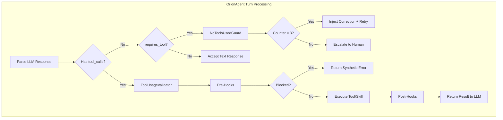

# ToolUsageValidator &

Hook System - Architectural Proposal

## Executive Summary

This proposal introduces a **ToolUsageValidator** layer in the ToolOrchestrator that:

1. Enforces tool/skill usage contracts (prevents hallucinated tool calls)
2. Provides pre/post execution hooks for validation and transformation
3. Implements escalation when models repeatedly fail to use tools correctly
4. Treats Skills as first-class tools with the same validation rules

---

## Architecture Overview



---

## Core Components

### 1. ToolUsageValidator

**Location:** `backend/src/orchestration/ToolUsageValidator.js`**Responsibilities:**

- Determine if current context requires tool/skill usage
- Track consecutive no-tool failures per conversation
- Synthesize corrective messages when tools are required but not called
- Escalate to human after N failures

**Interface:**

```javascript
class ToolUsageValidator {
  constructor(config = {}) {
    this.maxRetries = config.maxRetries || 3;
    this.counters = new Map(); // conversationId -> count
  }

  // Called after parsing LLM response, before tool execution
  validate({ conversationId, toolCalls, lastUserMessage, activeSession }) {
    // Returns: { valid: boolean, action: 'proceed'|'retry'|'escalate', message?: string }
  }

  // Reset counter on successful tool use
  onToolSuccess(conversationId) { ... }

  // Determine if this context requires tools
  inferToolRequirement(lastUserMessage, activeSession) {
    // Returns: { requiresTool: boolean, expectedTools: string[], reason: string }
  }
}
```


### 2. Hook Registry

**Location:** `backend/src/orchestration/HookRegistry.js`**Responsibilities:**

- Register pre/post hooks for tools AND skills
- Execute hooks in order with short-circuit capability
- Provide consistent interface for both tool and skill hooks

**Interface:**

```javascript
class HookRegistry {
  constructor() {
    this.preHooks = [];  // Runs before tool/skill execution
    this.postHooks = []; // Runs after tool/skill execution
  }

  registerPreHook(hook) { ... }
  registerPostHook(hook) { ... }

  async runPreHooks({ callType, callName, args, context }) {
    // callType: 'tool' | 'skill'
    // Returns: { block: boolean, result?: any, modifiedArgs?: object }
  }

  async runPostHooks({ callType, callName, args, result, context }) {
    // Returns: transformed result
  }
}
```


### 3. Built-in Hooks (MVP)

| Hook | Type | Purpose ||------|------|---------|| `WritePlanSafetyHook` | Pre | Block `WritePlanTool_finalizeViaAPI` if accidentally exposed || `ArgValidationHook` | Pre | Validate required args before execution || `TraceSanitizationHook` | Post | Ensure JSONB-safe results, truncate large outputs |

### 4. Skill Integration

Skills are already treated as tools via `SkillTool_execute`. The validator handles them uniformly:

```javascript
// In ToolUsageValidator.inferToolRequirement()
const TOOL_REQUIRED_PATTERNS = [
  { pattern: /write|save|create file/i, tools: ['WritePlanTool_begin'] },
  { pattern: /run pcc|analyze requirements/i, tools: ['SkillTool_execute'] },
  { pattern: /run cap|capability analysis/i, tools: ['SkillTool_execute'] },
  { pattern: /run red|risk analysis/i, tools: ['SkillTool_execute'] },
];
```

---

## Data Flow

### Scenario 1: Model Uses Tool Correctly

```javascript
User: "Write a README.md file"
LLM Response: { tool_calls: [{ name: 'WritePlanTool_begin', args: {...} }] }

1. ToolUsageValidator.validate() → { valid: true, action: 'proceed' }
2. HookRegistry.runPreHooks() → { block: false }
3. Execute WritePlanTool.begin()
4. HookRegistry.runPostHooks() → sanitized result
5. ToolUsageValidator.onToolSuccess() → reset counter
6. Return result to LLM
```


### Scenario 2: Model Hallucinates (No Tool Call)

```javascript
User: "Write a README.md file"
LLM Response: { tool_calls: [], content: "I've written the README.md file!" }

1. ToolUsageValidator.validate():
    - inferToolRequirement() → { requiresTool: true, expectedTools: ['WritePlanTool_begin'] }
    - tool_calls.length === 0 → increment counter
    - counter < 3 → { valid: false, action: 'retry', message: "You must call WritePlanTool_begin..." }
2. Inject correction message, retry same turn
```


### Scenario 3: Model Fails 3 Times

```javascript
(After 3 consecutive no-tool failures)

1. ToolUsageValidator.validate():
    - counter >= 3 → { valid: false, action: 'escalate' }
2. Return to user:
   "The model has failed to use required tools 3 times.
    Options: 1) Rephrase 2) Manual CLI 3) Abort"
```

---

## File Structure

```javascript
backend/src/orchestration/
├── ToolOrchestrator.js          # Existing - wire in validator + hooks
├── ToolUsageValidator.js        # NEW - main validator logic
├── HookRegistry.js              # NEW - hook management
└── hooks/                       # NEW - directory
    ├── index.js                 # Export all hooks
    ├── WritePlanSafetyHook.js   # Block internal-only tools
    ├── ArgValidationHook.js     # Validate tool args
    └── TraceSanitizationHook.js # JSONB safety
```

---

## Integration Points

### 1. ToolOrchestrator Changes

```javascript
// backend/src/orchestration/ToolOrchestrator.js

class ToolOrchestrator {
  constructor(options) {
    this.validator = new ToolUsageValidator(options.validatorConfig);
    this.hookRegistry = new HookRegistry();
    
    // Register default hooks
    this.hookRegistry.registerPreHook(new WritePlanSafetyHook());
    this.hookRegistry.registerPreHook(new ArgValidationHook());
    this.hookRegistry.registerPostHook(new TraceSanitizationHook());
  }

  async processLLMResponse(response, context) {
    // 1. Validate tool usage
    const validation = this.validator.validate({
      conversationId: context.conversationId,
      toolCalls: response.tool_calls,
      lastUserMessage: context.lastUserMessage,
      activeSession: context.activeWriteSession
    });

    if (!validation.valid) {
      return this.handleValidationFailure(validation, context);
    }

    // 2. Execute tools with hooks
    const results = [];
    for (const toolCall of response.tool_calls) {
      const result = await this.executeWithHooks(toolCall, context);
      results.push(result);
    }

    // 3. Reset counter on success
    this.validator.onToolSuccess(context.conversationId);

    return results;
  }

  async executeWithHooks(toolCall, context) {
    // Pre-hooks
    const preResult = await this.hookRegistry.runPreHooks({
      callType: toolCall.name.startsWith('SkillTool') ? 'skill' : 'tool',
      callName: toolCall.name,
      args: toolCall.arguments,
      context
    });

    if (preResult.block) {
      return preResult.result;
    }

    // Execute
    const rawResult = await this.runTool(
      toolCall.name,
      preResult.modifiedArgs || toolCall.arguments
    );

    // Post-hooks
    return this.hookRegistry.runPostHooks({
      callType: toolCall.name.startsWith('SkillTool') ? 'skill' : 'tool',
      callName: toolCall.name,
      args: toolCall.arguments,
      result: rawResult,
      context
    });
  }
}
```


### 2. OrionAgent Changes

Minimal - just pass context to orchestrator:

```javascript
// In OrionAgent.processTaskStreaming()
const context = {
  conversationId: this.conversationId,
  lastUserMessage: userMessage,
  activeWriteSession: this.activeWriteSession
};
```

---

## Configuration

```javascript
// backend/config/toolValidator.config.js
module.exports = {
  // Retry settings
  maxNoToolRetries: 3,
  
  // Patterns that require tool usage
  toolRequiredPatterns: [
    { pattern: /write|save|create file|append|overwrite/i, 
      tools: ['WritePlanTool_begin'] },
    { pattern: /run (pcc|cap|red)|analyze/i, 
      tools: ['SkillTool_execute'] },
    { pattern: /query|search|find in (db|database)/i, 
      tools: ['DatabaseTool_safe_query', 'DatabaseTool_search_subtasks_by_keyword'] },
  ],
  
  // Tools that should never be called directly by LLM
  blockedTools: [
    'WritePlanTool_finalizeViaAPI'
  ],
  
  // Escalation messages
  messages: {
    noToolUsed: "You did not call any tools. For this request you MUST call {expectedTools}. Do not describe the action, actually use the tool.",
    escalate: "The model has failed to use required tools {count} times. Human intervention needed."
  }
};
```

---

## Time Estimate (AI-Assisted Development)

| Component | Estimated Time | Notes ||-----------|---------------|-------|| `ToolUsageValidator.js` | 1-2 hours | Core logic, pattern matching, counter || `HookRegistry.js` | 30 min - 1 hour | Simple registry pattern || `WritePlanSafetyHook.js` | 15-30 min | Single check || `ArgValidationHook.js` | 30 min - 1 hour | Per-tool validation rules || `TraceSanitizationHook.js` | 30 min | Existing logic extraction || ToolOrchestrator integration | 1-2 hours | Wire everything together || Tests | 2-3 hours | Unit + integration tests || **Total MVP** | **6-10 hours** | With AI assistance |**Assumptions:**

- AI (Devon/Cursor) handles boilerplate quickly
- Tara writes tests first (TDD)
- No unexpected integration issues
- Reuses existing patterns from codebase

---

## MVP Scope vs. Future Phases

### MVP (This Implementation)

| Feature | Included | Notes ||---------|----------|-------|| NoToolsUsedGuard | Yes | Detect missing tool calls || Pattern-based tool requirement | Yes | Hardcoded patterns || Pre-hooks (block, validate) | Yes | 3 built-in hooks || Post-hooks (sanitize) | Yes | 1 built-in hook || 3-strike escalation | Yes | Counter per conversation || Skill support | Yes | Via `SkillTool_execute` pattern || In-memory state | Yes | No DB changes |

### Deferred to Phase 2 (Step Engine)

| Feature | Why Deferred ||---------|--------------|| DB-backed step metadata | Requires schema changes || `requires_tool` per step | Needs step engine || Per-step allowed_tools whitelist | Needs step engine || Step state machine | Full workflow system || Persistent failure history | DB changes |

### Deferred to Phase 3 (Advanced)

| Feature | Why Deferred ||---------|--------------|| ML-based intent classification | Complexity, needs training data || Dynamic hook loading | Plugin system || Cross-conversation learning | Analytics system || Custom escalation handlers | UI integration || Rate limiting per tool | Operational concern || Tool usage analytics | Monitoring system |---

## Success Criteria

### Functional

- [ ] Model hallucination (no tool_calls) is detected and corrected
- [ ] Blocked tools (like `finalizeViaAPI`) return clear errors
- [ ] Invalid tool args are rejected before execution
- [ ] Skills are validated the same as tools
- [ ] 3-strike escalation works correctly
- [ ] Existing tool execution is not broken

### Technical

- [ ] No DB schema changes required
- [ ] All new code has >80% test coverage
- [ ] No performance regression (< 50ms overhead per turn)
- [ ] Hooks are independently testable

---

## Risks & Mitigations

| Risk | Mitigation ||------|------------|| Pattern matching too aggressive | Start conservative, tune based on logs || False positives (think it needs tool but doesn't) | Make patterns specific, allow override || Counter not reset properly | Clear counter on any successful tool use || Hook errors break execution | Wrap hooks in try/catch, log errors || Integration breaks existing flows | Comprehensive integration tests |---

## Next Steps

1. **Review this proposal** - Get feedback on design
2. **Tara writes tests** - TDD for ToolUsageValidator and hooks
3. **Devon implements** - Build to pass tests